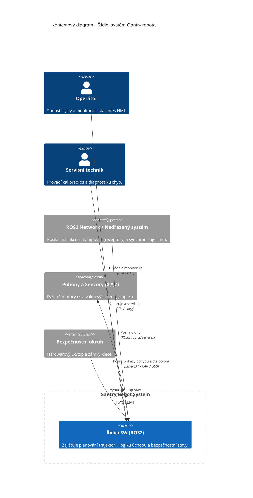

# 1. Řídící systém robotického manipulátoru
Autor: Jan Matouš 

Předmět: Softwarové inženýrství

Akademický rok 2025/2026

Vedoucí předmětu: Ing. Pavel Steinbauer, Ph.D. a Ing. Jan Pelikán, Ph.D.

## 1.1.Vision and Scope

  ### Vision

Cílem projektu je návrh řídícího systému pro 3-osý pick and place manipulátor typu Gantry, který automatizuje manipulaci s výrobním materiálem v prostředí poloautonomní výrobní linky. Systém zajistí nepřetržitost výroby, vysokou opakovatelnost a eliminaci rizika práce s agresivní chemií. 

  
   
  <i>obr. 1.1 - Robotický manipulátor</i>

  
   
  <i>obr. 1.2 - CAD model robotického manipulátoru</i>

### Stakeholders
1. **Operátor výroby** - interaguje s manipulátorem, kontroluje správnost chodu stroje, ovládá kličové ochranné prvky (stop tlačítko)
2. **Servisní technik** - dohlíží nad správným a funkčím stavem manipulátoru (diagnostika, kalibrace senzorů)
3. **Koordniátor výroby** - monitoring efektivity linky, plánování kapacit, směn
4. **Bezpečnostní technik** - soulad s bezpečnostními normami ISO, validace fungování 
5. **Vývojář řídícího systému** - nasazení a aktualizace firmware/software
  
### Klíčové scénáře

1. **Inicializace a homing** - robot zaručeně a bezpečně najde referenční polohy všech 3 os
2. **Pick and place cyklus** - přesun materiálu ze zásobníku do konkrétního slotu v chemické lázni
3. **Výměna lázně** - přesun robota do bezpečné polohy umožňující servis lázní
4. **Krizové zastavení** - Okamžité zastavení motorů při narušení pracovního prostoru nebo stistku STOP tlačítka
5. **Detekce chyby úchopu** - rozpoznání nesprávného úchopu výrobního materiálu a přerušení cyklu

### Odhad rizik
1. **Koroze** - vlivem chemických výparů může docházet k poškození senzorů a dalších kritických součástek
2. **Kolize** - mechanické poškození vlivem chyby trajektorie/souřadnicového systému 
3. **Selhání manipulace** - vlivem nepřesnosti výroby, nemožnost manipulovat (variabilita v rozměrech destiček, další deformace)

### Plán ověření
"Úspěchem nazveme stav, kdy dojde k autonomnímu vykonání 30 cycklů bez chyby úchopu a v případě otevření klece dojde k zastavení manipulátoru do 500 ms."

### Seznam podnětů z okolí 

1. **Uchop desku** - v X,Y,Z koordinací předá ROS síť požadavek o vyzvednutí desky
2. **Bezpečnostní zastavení** - vlivem otevření klece dojde k poslání signálu k zastavení manipulátoru
3. **Home sekvence** - signál k inicializaci polohy manipulátoru
4. **Neuchopení desky** - signál koncových čidel o neuchopení deksy

### Seznam rolí a aktérů
- **Operátor** - primární aktér - Účastní se běžného provozu, spouští chod a provádí vizuální kontrolu linky jak přes panel, tak okometricky

- **Servisní technik** - technická role - Údržb mechaniky, kalibrace os a dignostiky softwarovcýh chyb
- **Bezpečnostní technik** - bezpečností role - Zodpovíva za schálení bezpečnostních limitů, konfiguraci stop stavu a revizi klece
- **Systémový administrátor** - IT role - Správa síťové infrastruktury a verzování řídícího software
  
### Základní omezení
Technické i legislativní omezení:

- **Hardware** - Tří osá kontruskce s pohonem přes krokové motory, odolný gripper vůči chemické korozi 
  
- **Rozhraní** - Komunikace mezi moduly probíhá přes standarty ROS2
  
- **Standardy a normy** - Systém musí splňovat normy **ISO 10218** - průmyslové roboty - bezpečnost a směrnice pro práci v chemickém prostředí
  
- **Bezpečností limity** - Maximální rychlost pohybu v blízkosti okraje lázní omezena na 200 mm/s, zároveň okamžíté zastavení při detekci vniknutí do klece
  
- **Reálný čas** - Řídící smyčka pro plánování trajektorie běží s pevnou periodou pro zaručení stability pohybu 

### Plán práce týmu a rozdělení rolí
| Fáze projektu | Odpovědná role | Výstup (Artefakt) |
| :--- | :--- | :--- |
| **Analýza a vize** | Systémový architekt | Vision & Scope dokumentace, C4 diagram |
| **Specifikace požadavků** | Requirements Engineer | Seznam FR a NFR, Use-case model |
| **Návrh a modelování** | SW Inženýr | Doménový model, stavové automaty |
| **Ověřování a testy** | V&V Specialista | Testovací případy, V&V matice |
| **Prototypování** | Vývojář | ROS2 simulace, kód klíčové funkce |

## 1.2. Requirements Specification

## 1.3. Model system

## 1.4. Verification and Validation 

## 1.5. Prototype
