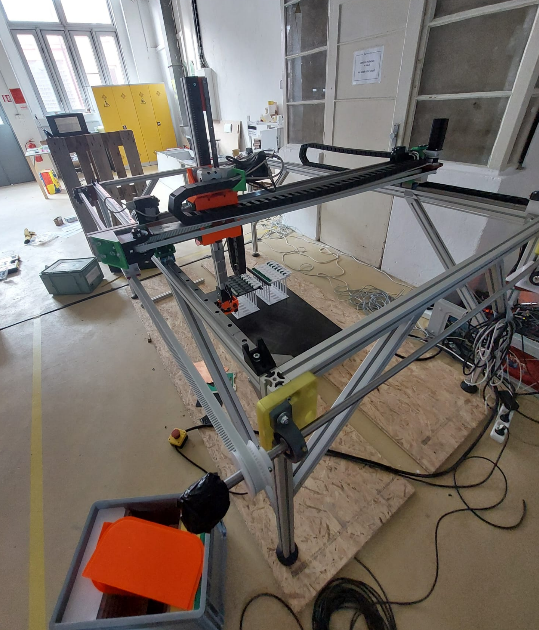
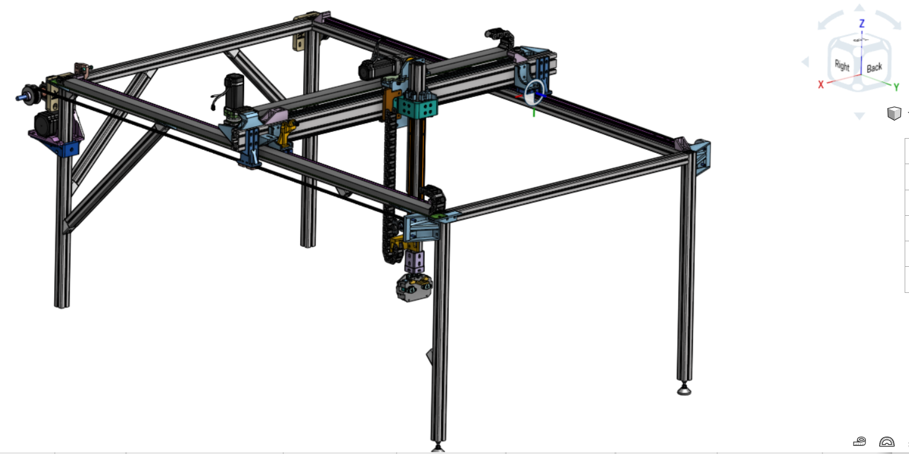
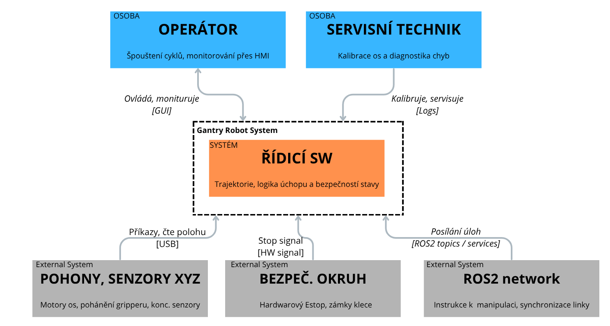
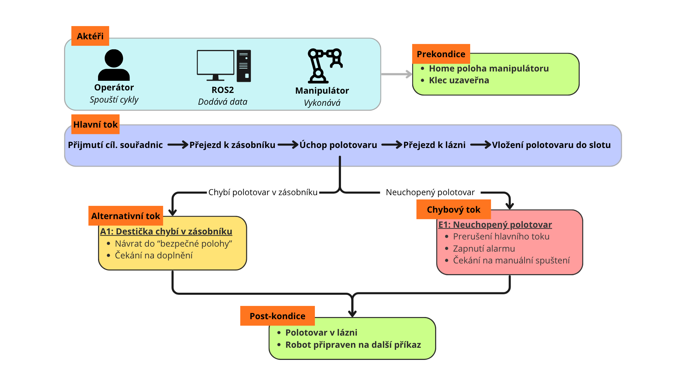
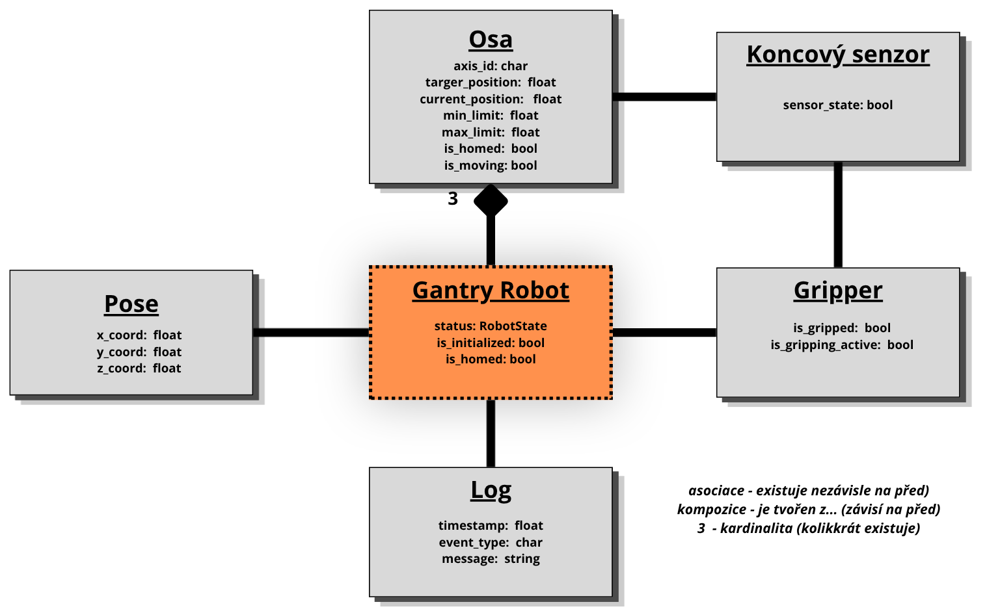
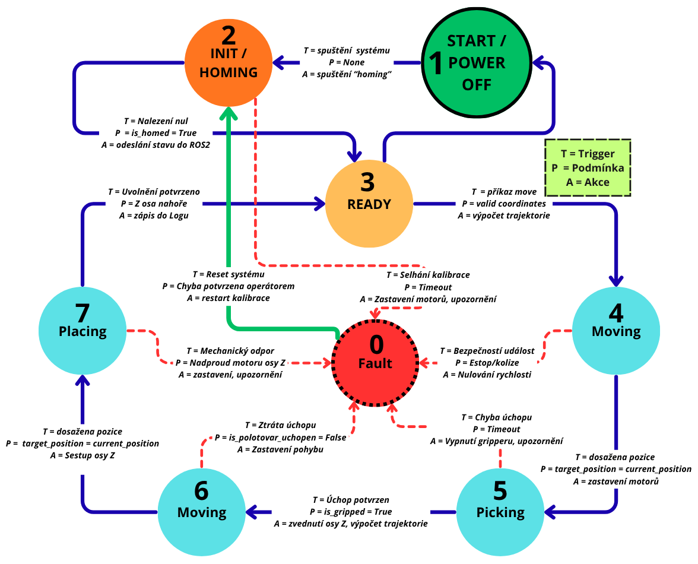
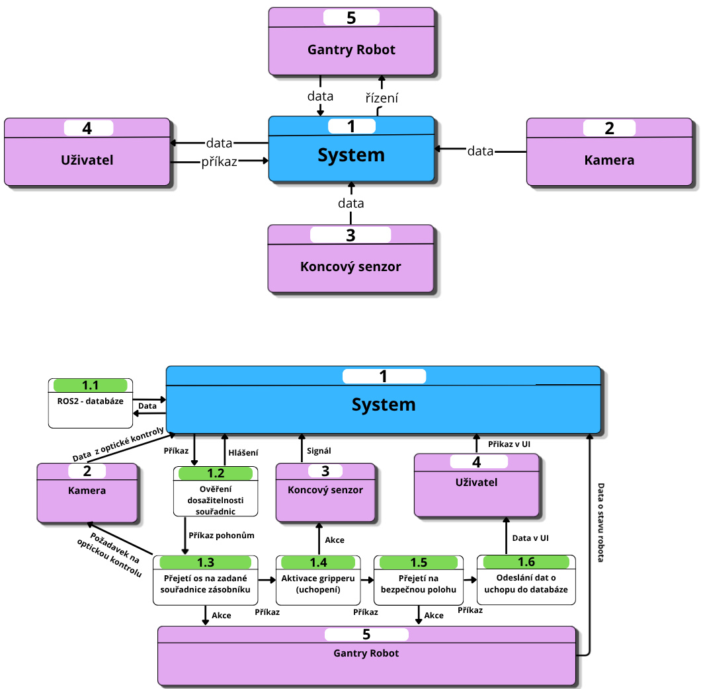
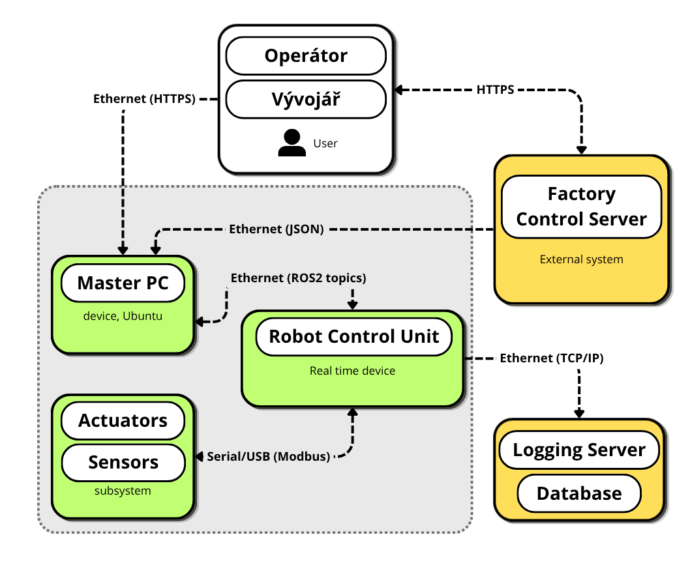

# 1. Řídící systém robotického manipulátoru
Autor: Jan Matouš 

Předmět: Softwarové inženýrství

Akademický rok 2025/2026

Vedoucí předmětu: Ing. Pavel Steinbauer, Ph.D. a Ing. Jan Pelikán, Ph.D.

  

## 1.1.Vision and Scope

  

### Vision

Cílem projektu je návrh řídícího systému pro 3-osý pick and place manipulátor typu Gantry, který automatizuje manipulaci s výrobním materiálem v prostředí poloautonomní výrobní linky. Systém zajistí nepřetržitost výroby, vysokou opakovatelnost a eliminaci rizika práce s agresivní chemií. 

  
   
  <i>obr. 1.1 - Robotický manipulátor</i>

 

  
   
  <i>obr. 1.2 - CAD model robotického manipulátoru</i>

### Stakeholders
1. **Operátor výroby** - interaguje s manipulátorem, kontroluje správnost chodu stroje, ovládá kličové ochranné prvky (stop tlačítko)
2. **Servisní technik** - dohlíží nad správným a funkčím stavem manipulátoru (diagnostika, kalibrace senzorů)
3. **Koordniátor výroby** - monitoring efektivity linky, plánování kapacit, směn
4. **Bezpečnostní technik** - soulad s bezpečnostními normami ISO, validace fungování 
5. **Vývojář řídícího systému** - nasazení a aktualizace firmware/software
  
### Klíčové scénáře

1. **Homing** - Synchronizace fyzické polohy motorů s logickým nulovým bodem softwaru pro definování souřadného systému.
2. **Pohyb na souřadnice (Point-to-Point)** - Přesun Tool Center Pointu (TCP) na kokntréntí zadané souřadnice (X,Y,Z) v rámci pracovního prostoru
3. **Úchop desky** - Sestup osy Z k polotovaru, aktivace gripperu a ověření dosažení úchopu skrz koncový spínač
4. **Uvolnění desky** - Přesné uložení desky do slotu a uvolnění úchopu gripperu
5. **Nouzové brzdění** - Prioritní přerušení všech probíhajícíh pohybů a odpojení výkonu pohonů při detekci narušení bezpečnosti
6. **Monitoring stavu** - Periodické odesílání informací o aktuální poloze, rychlosti do nadřazeného systému 

### Odhad rizik
1. **Koroze** - vlivem chemických výparů může docházet k poškození senzorů a dalších kritických součástek
2. **Kolize** - mechanické poškození vlivem chyby trajektorie/souřadnicového systému 
3. **Selhání manipulace** - vlivem nepřesnosti výroby, nemožnost manipulovat (variabilita v rozměrech destiček, další deformace)

### Plán ověření
"Úspěchem nazveme stav, kdy dojde k autonomnímu vykonání 30 cycklů bez chyby úchopu a v případě otevření klece dojde k zastavení manipulátoru do 500 ms."

### Kontextový diagram

  
   
  <i>obr. 1.3 - Kontextový diagram</i>

### Seznam podnětů z okolí 

1. **Uchop desku** - v X,Y,Z koordinací předá ROS síť požadavek o vyzvednutí desky
2. **Bezpečnostní zastavení** - vlivem otevření klece dojde k poslání signálu k zastavení manipulátoru
3. **Home sekvence** - signál k inicializaci polohy manipulátoru
4. **Neuchopení desky** - signál koncových čidel o neuchopení deksy

### Seznam rolí a aktérů
- **Operátor** - primární aktér - Účastní se běžného provozu, spouští chod a provádí vizuální kontrolu linky jak přes panel, tak přes vizuální kontrolu

- **Servisní technik** - technická role - Údržb mechaniky, kalibrace os a dignostiky softwarovcýh chyb
- **Bezpečnostní technik** - bezpečností role - Zodpovíva za schálení bezpečnostních limitů, konfiguraci stop stavu a revizi klece
- **Systémový administrátor** - IT role - Správa síťové infrastruktury a verzování řídícího software
  
### Základní omezení

Technické i legislativní omezení:
  
- **Komunikační standardy** - Komunikace mezi moduly probíhá přes standardy ROS2 zpráv
  
- **Software safety** - V případě výpadku komunikace nebo překročení mezních hodnot (překročení rychlosti nad xxx mm/s) software autonomně vyvolá stop stav bez zásahu nadřazené sítě.
  
- **Reálný čas** - Řídící smyčka pro plánování trajektorie běží s pevnou periodou pro zaručení stability pohybu 
  
- **Legislativní normy** - Návrh SW architektury musí odpovídat požadavkům normy ISO 10218 na spolehlivost logických bezpečnostních funkcí. Kód musí být verzován (Git) a dokumentován pro potřeby budoucí certifikace.

### Plán práce týmu a rozdělení rolí

| Fáze projektu | Odpovědná role | Výstup (Artefakt) |
| :--- | :--- | :--- |
| **Analýza a vize** | Systémový architekt | Vision & Scope dokumentace, C4 diagram |
| **Specifikace požadavků** | Requirements Engineer | Seznam FR a NFR, Use-case model |
| **Návrh a modelování** | SW Inženýr | Doménový model, stavové automaty |
| **Ověřování a testy** | V&V Specialista | Testovací případy, V&V matice |
| **Prototypování** | Vývojář | ROS2 simulace, kód klíčové funkce |

 
<i>tab. 1.1 - Rozdělení rolí v týmu</i>

 

  

## 1.2. Requirements Specification

  

Cílem je definování systému tak, aby byl jednoznačný, testovatelný a zaměřený na softwarové řízení 3-osého manipulátoru.

### Usecase model
Model se zaměřuje na elementární (atomické) operace systému, ze kterých se skládají komplexní procesy.

**Seznam elementárních případů užití:**

  - **UC_01**: Inicializace (Homing) – kalibrace os

- **UC_02**: Pohyb na souřadnice – nízkoúrovňové řízení trajektorie.

- **UC_03**: Úchop polotovaru (Pick) – aktivace a kontrola gripperu

- **UC_04**: Uvolnění polotovaru (Place) – deaktivace gripperu a potvrzení.

- **UC_05**: Nouzové zastavení – prioritní přerušení SW smyčky.

další operace systému, které už nejsou součástí diagramu:

-  **UC_06**: Ověření dosažitelnosti souřadnic - ověření správnost zadaných souřadnic v porovnání s pracovním prostorem

-  **UC_07**: Odeslání dat do databáze - log informace o průběhu stavů v robotu

 

  
   
  <i>obr. 1.4 - Usecase diagram</i>

#### Seznam požadavků (FR & NFR)

| ID | Požadavek | Priorita | Zdroj | Verifikace | Evidence |
| :--- | :--- | :--- | :--- |:--- | :--- |
| **FR-01** | Systém musí umožnit automatickou kalibraci všech 3 os (Homing) | Vysoká | Servisní technik | Test | Konzole ROS2 (zpráva)
| **FR-02** | Pohyb (P2P): Systém musí umožnit přesun TCP na definované souřadnice X, Y, Z s přesností ± 0.1 mm. |Vysoká | Provozní scénář | Demonstrace| Porovnání cílových a aktuálních souřadnic
| **FR-03** | Systém musí aktivovat a  detekovat úspěšný úchop destičky pomocí koncového senzoru | Vysoká |Provozní scénář| Test | Změna v provozním logu u gripper_status
| **FR-04** | Systém deaktivuje gripper a potvrdí uvolnění gripperu před odjezdem osy Z | Vysoká |Provozní scénář| Test | Log událostí a následná změna Z souřadnic
| **FR-05** | Systém musí umožnit posuv os v servisním režimu | Nízka |Servisní technik| Test | Záznam o přijetí příkazu z ovladače (panel)
| **FR-06** | Systémově implementované softwarově mechanické limity | Vysoká | Bezpečnostní technik | Test | Chybová hláška v terminálu při pohybu mimo rozsah
| **FR-07** | Ukládání systémových dat o dokončených cyklech, chybových hlášení a stavu senzorů do logu a odesílat přes ROS2 v realtimu | Střední | Záznám výsledků | Analýza logu | soubor .log na disku s historií dat
| **NFR-01** | Systém musí přejít do bezpečného stop-stavu při detekci poruchy/červeného tlačítka   do 500 ms (Failsafe). | Kritická | Bezpečnostní technik | Měření | Časový rozdíl v logu mezi chybou a zastavením motoru
| **NFR-02** | Provozuschopnost systému víc než 95 % plánované výrobní doby  | Vysoká | Koordnitánor výroby | Analýza logu |Report z diagnostického modulu
| **NFR-03** | Síťová komunikace ROS2 izolována od veřejné sítě a ochráněna od neoprávných příkazů | Vysoká | Vývojář | Inspekce sítě | Konfigurační soubor firewallu

 
<i>tab. 1.2 - Tabulka se seznamem požadavků (FR & NFR)</i>

 

**Požadavky na rozhraní**

- **SW rozhraní** - ROS2 API
- **HW rozhraníí** - Signál z koncového senzoru, řízení přes USB/CAN
- **Časování** - Perioda řídící smyčky 10 ms

**Stop stavy a chování při poruchách**

- **Failsafe režim** - při ztrátě komunika s nadřazeným systémem musí robot dokončit pohyb do neutrální polohy nebo okamžitě zastavit
- **Emergency STOP** - Fyzické odpojení napájení motorů při narušení klece

#### Akceptační kritéria rozhraní

||Detekce neúspěšného úchopu - navázáno na FR-03|
| :--- | :--- | 
| **Given** | Robot se nachází na zásobníkem a spustil uchopovací cyklus
| **When** | Koncový senzor nahlásí zmáčknutí koncového spínače indikující chybějící polotovar
| **Then** | Robot přeruší cyklus, zvedne osu Z do bezpečné výšky a aktivuje alarm |

 
<i>tab. 1.3 - Akceptační kritéria rozhraní pro FR-03 </i>
 
 

||Reakce na nouzové zastavení - navázáno na NRF-01|
| :--- | :--- | 
| **Given** | Robot provádí pohyb v libovolné ose
| **When** | Dojde k rozpojení bezpečnostního okruhu (tlačítko, otevření klece)
| **Then** | Systém odpojí pohony a veškerý pohyb se zastaví do 500 ms |

 
<i>tab. 1.4 - Akceptační kritéria rozhraní - pro NRF-01 </i>

 

  

## 1.3. Model system

  

Specifikujeme vnitřní strukturu a dynamické chování řídícího systému pro Gantry robot. Modely definují rozhraní mezi jednotlivámi softwarowými moduly a jejich interakci s okolím.

**Doménový model**

Doménovým modelem reprezentujeme vztahy mezi klíčovými objekty v problémové doméně. Kde systém je rozdělen na logické třídy, vztahy a datové entity.

  
   
  <i>obr. 1.5 - Doménový model</i>

**Dynamický model: Stavový automat**

Stavový automat definuje deterministické chování robota. Zajišťuje, že systém reaguje na podněty pouze v logických stavech.

Klíčovým prvkem je stav Fault, do kterého systém přechází při jakékoli anomálii. Dále systémové chování popisují přechody mezi pracovními stavy, kde každý přechod je hlídán logickou podmínkou.

 

  
   
  <i>obr. 1.6 - Dynamický model </i>

**Procesní model - Data Flow Diagram**
Vytvořen pro klíčový  proces - Úchop polotovaru

  
   
  <i>obr. 1.7 - Data Flow Diagram </i>

**Model rozhraní a nasazení**

Model popisující fyzické a logické rozmístění softwarových komponent na hadrwarových uzlech. Rozdělení na vnitřní podstruktury systému a vnější entity jako například "Factory Control Server", se kterým systém komunikuje.

  
   
  <i>obr. 1.8 - Model rozhraní a nasazení</i>

  

## 1.4. Verification and Validation

  

**V&V Matice - Traceability**

Pro vybrané požadavky z kapitoly 1.2

| ID | Požadavek | Metoda ověření | Specifikace ověření | Test Case ID |
| :--- | :--- | :--- | :--- | :--- |
|FR-01 | Homing | Zátěžový test | 10x po sobě jdoucí úspěšná kalibrace z náhodných počátečních poloh os | TC-01
FR-02 | Přesnost pohybu | Měření | Najetí na 3 náhodné body v 5 opakováních, výpočet odchylky | TC-02
|FR-03| Úchop | Test | 20 cyklů úchopu a zdvihu bez pádu polotovaru nebo falešné detekce uchopení | TC-03
|FR-06| Soft Limity | Negativní test | 5 pokusů o zadání souřadníc mimo pracovní prostor přes ROS2 | TC-04
|NFR-01| Stop stav | Časová analýza | 10x simulace chyby, změření času od logu události po zastavení příkazu motorů | TC-05
|NFR-02|   Uptime 95 % | Test | 24hodinový běh v simulovaném stress-test cyklu |  TC-06

<i>tab. 1.5 - V&V Matice - Traceability</i>

 

**Testovací strategie po úrovních**

Pro omezení fyzických škod způsobené chybami softwaru, přistoupíme k testingu pomocí víceúrovňové simulace, ve které postupně zvyšujeme množinu celku zapojení robota.

1. **Unit Testing** - Testování jednotlivých funkcí (výpočet inverzní kinematiky, parsování ROS2 zpráv) bez nutnosti připojeného HW
   
2. **Software in the Loop** - Testování kompletního kódu v simulovaném prostředí (například Gazebo), kde pozorujeme chování robota ve virtuálním prostředí.
3. **Hardware in the Loop** - Řídící algoritmus běží na Master PC, ale je připojem k realným driverům motorů bez mechanické zátěže pro otestování komunikace.
4. **System Inert Fluid Testing** - První testování stroje v prostředí lázní plněné inertní kapalinou (vodou)
5. **System Stress Testing** - Vědomé přetězování softwarové logiky v bezpečném prostředí (bez chemie) 
6. **System Endtesting**  - Finální testování kompletního stroje v chemickém provozu 

**Test cases**

| ID | Název testu | Vstupní podmínka | Očekávaný výsledek | Pass/Fail kritérium |
| :--- | :--- | :--- | :--- | :--- |
|TC-01 | **Homing Sequence** | 10x - Start systému, osy v náhodných polohách | Robot najde 3 koncové spínače a vynuluje souřadnice | isHomed == True a rozptyl nalezených nulových bodů <0,05 mm| 
|TC-02 | **P2P Accuracy** | 5x - Příkaz pohybu na bod1, bod2, bod3  | Robot se zastaví na pozici | Max. odchylka mezi cílovou a skutečnou polohou v každém kroku <0.1 mm|
|TC-03a| **Pick Succes** | Polotovar v zásobníku, příkaz Pick | Koncový senzor sepne a změní stav na Gripped | is_gripped = True |
|TC-03b| **Pic Failure (empty)** | Zásobník prázdný, příkaz Pick | Po 2s timeoutu, systém nahlásí chybu a přejede do bezpečné polohy | Stav - Fault, zprává ROS2 operátorovi |
|TC-04| **Soft Limit Breach** | Pokus o pohyb na "přeslimitní" souřadnice| Software odmítne vykonat pohyb dřív, než se motory pohnou| Chybová hláška v konzoli|
|TC-05| **Emergency Stop**| Stisk E-stop tlačítka během pohybu | Okamžité zastavení všech os do 500 ms| Časový rozdíl v logu t<500 ms |
|TC-06| **24 hod - Zátěžový Test**| Skript s nekonečnou frontou náhodných, validních souřadnic v pracovním prostoru | Systém vykoná cykly bez pádu uzlů nebo kritického nárustu spotřeby | Systém běží minimálně 95 % testovaného času bez nutnosti restartu softwaru v simulovaném prostředí - SIF |

 
<i>tab. 1.6 - Tabulka Test Cases </i>

 

**Plán záznamu výsledků**

Pro splnění požadavků na evidenci, použijeme tyto nástroje:

 - **ROS Bags** - Záznam všech dat protékajících systémem (témata, zprávy, časy)
 - **System Logs** - Textové záznamy o stavových přechodech
 - **Telemetry values** - CSV exporty z dashbordu pro porovnání přesnosti pohybu
 - **Screenshots** - Snímky z RViz vizualizace pro potvrzení shody modelu s realitou.

  

## 1.5. Prototype

  

